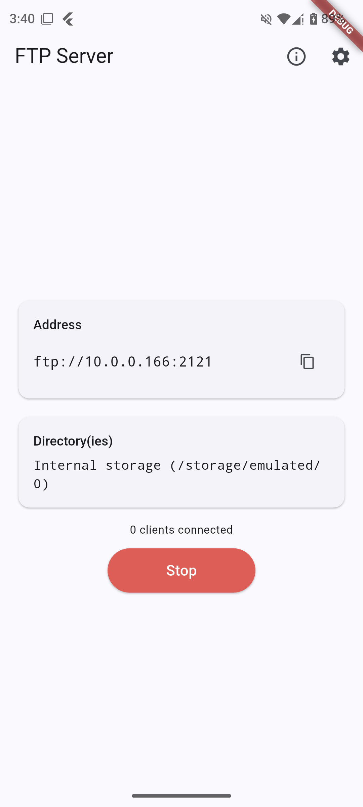
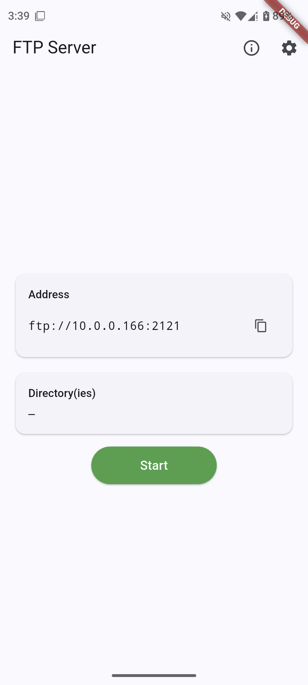
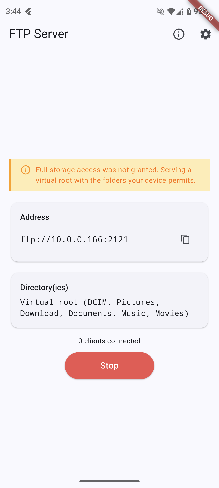
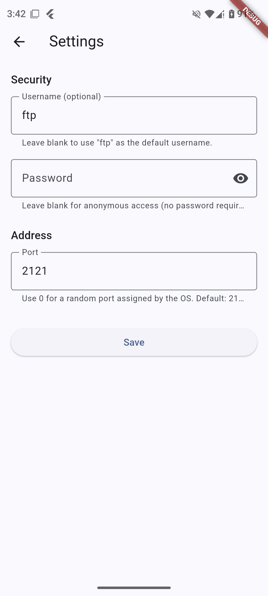
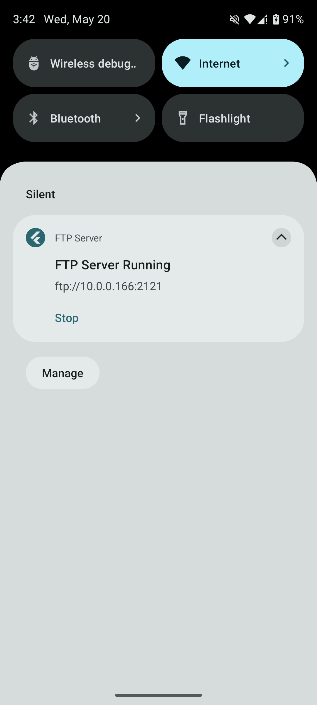
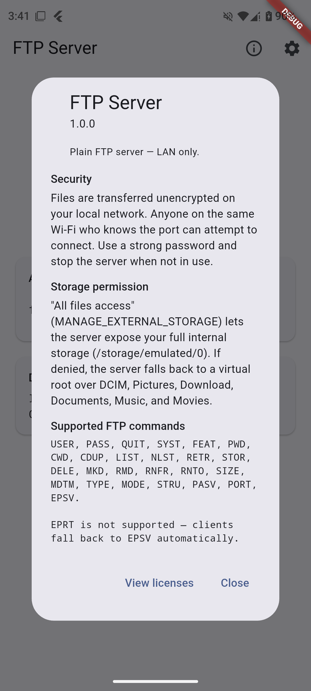

# ftp_app

> Turn your Android phone into an FTP server and browse its storage from any computer on the same Wi-Fi network.

<p align="center">
  
</p>

---

## What it does

`ftp_app` runs an FTP **server** on your phone. Once started, any FTP client on the same LAN (Windows Explorer, macOS Finder, FileZilla, WinSCP, etc.) can connect to the address shown on the main screen and browse, download, upload, rename, and delete files in your phone's storage.

The defining design choice: **expose as much of the phone's storage as possible**, as close to the root as Android will allow. No folder-by-folder picker.

- If `MANAGE_EXTERNAL_STORAGE` is granted → serves the full `/storage/emulated/0` tree (native-root mode).
- If denied → falls back to a **virtual root** that unions every public directory the OS still lets the app read (DCIM, Pictures, Download, Documents, Music, Movies).

The server keeps running while the app is backgrounded thanks to an Android foreground service.

---

## Screenshots

### Main screen

| Stopped | Running (native root) | Running (virtual root) |
|---|---|---|
|  |  |  |

The `Directory(ies)` card tells you exactly what's being served. In **native-root** mode you see `Internal storage (/storage/emulated/0)` — the same tree your phone's Files app shows. In **virtual-root** mode you see a comma-separated list of the public folders that were readable (e.g. `Virtual root (DCIM, Pictures, Download, …)`).

### Settings

<p align="center">
  
</p>

- **Username + password** — leave both blank for anonymous access, or set either or both to require authentication. If only the password is set, clients should log in as `ftp`.
- **Port** — defaults to `2121`. Port 21 requires root on Android; `0` requests an OS-assigned ephemeral port (the bound port is shown back to you on the main screen).

### Foreground notification

<p align="center">
  
</p>

While the server is running, Android shows a persistent notification with the bound FTP address and a **Stop** action. This is required for Android to keep the socket alive when the app is backgrounded.

### About

<p align="center">
  
</p>

---

## How storage access works

```
┌──────────────────────────────────────────────────────────────────┐
│   Press Start                                                    │
└────────────────────────────────┬─────────────────────────────────┘
                                 ▼
                ┌─────────────────────────────────┐
                │  MANAGE_EXTERNAL_STORAGE        │
                │  granted?                       │
                └──────────┬──────────┬───────────┘
                           │          │
                       yes │          │ no
                           ▼          ▼
        ┌──────────────────────┐   ┌────────────────────────────┐
        │  Native-root mode    │   │  Virtual-root mode         │
        │  Serve /storage/     │   │  Union of readable public  │
        │  emulated/0          │   │  dirs (DCIM, Pictures, …)  │
        └──────────────────────┘   └────────────────────────────┘
```

Permission is requested the first time you press Start. Granting it opens the Android Settings screen for "All files access" — toggle the switch and return to the app. If you skip this, the server still starts, just in virtual-root mode with fewer directories visible.

---

## Build & run

This is a standard Flutter project. From the project root:

```bash
flutter pub get
flutter run            # debug build on a connected Android device
flutter build apk      # release APK in build/app/outputs/flutter-apk/
```

Tests:

```bash
flutter test                                        # all unit + widget tests
flutter test test/storage_access_service_test.dart  # one file
flutter analyze                                     # static analysis
```

### Android setup notes

Permissions declared in `android/app/src/main/AndroidManifest.xml`:

- `INTERNET`, `ACCESS_NETWORK_STATE`, `ACCESS_WIFI_STATE` — bind the LAN socket, discover the Wi-Fi IP.
- `MANAGE_EXTERNAL_STORAGE` — native-root mode (Google Play policy applies; sideload-friendly).
- `FOREGROUND_SERVICE`, `FOREGROUND_SERVICE_DATA_SYNC` — keep the server alive when backgrounded.
- `POST_NOTIFICATIONS` (Android 13+) — show the persistent notification.

---

## Tech stack

| Layer | Package |
|---|---|
| FTP protocol | [`ftp_server`](https://pub.dev/packages/ftp_server) (Dart-native, no Apache MINA or platform channels) |
| State / DI | [`provider`](https://pub.dev/packages/provider) over `ChangeNotifier` |
| Foreground service | [`flutter_foreground_task`](https://pub.dev/packages/flutter_foreground_task) |
| Permissions | [`permission_handler`](https://pub.dev/packages/permission_handler) |
| Wi-Fi IP discovery | [`network_info_plus`](https://pub.dev/packages/network_info_plus) |
| Settings persistence | [`shared_preferences`](https://pub.dev/packages/shared_preferences) + [`flutter_secure_storage`](https://pub.dev/packages/flutter_secure_storage) for the password |

### Architecture in one paragraph

`ServerController` (a `ChangeNotifier`) orchestrates the lifecycle. It asks `StorageAccessService` whether to serve the native root or build a virtual one, hands the result to `FtpEngine` (which wraps the `ftp_server` package), then starts the foreground service. `MainScreen` subscribes via `context.watch<ServerController>()` and rebuilds whenever the status changes.

---

## Security notes

- **Plain FTP only.** No FTPS or SFTP. Credentials and file data traverse the LAN in cleartext. Use on trusted Wi-Fi only.
- **Passwords are stored** in Android's encrypted secure storage (Keystore-backed), never in plain SharedPreferences.
- **Path traversal** protection is provided by the `ftp_server` package's `PhysicalFileOperations` / `VirtualFileOperations`.
- **Anonymous mode** is opt-in: it activates only when both username and password are blank.

---

## Limitations

- Android only. iOS sandboxing fundamentally conflicts with the "as close to root as possible" goal; iOS support is not planned.
- No encryption (see above).
- One FTP server instance at a time; the bound port is owned exclusively until the server stops.
- `EPRT` is not implemented by the underlying `ftp_server` package — clients fall back to `EPSV`/`PASV` automatically.
